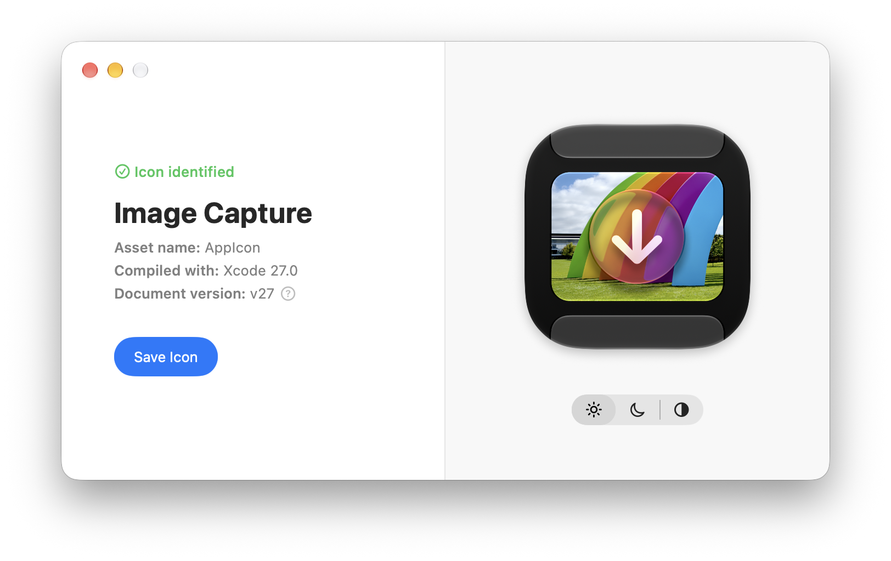

# Recompose

Recompose is an experimental macOS app that reconstructs an Icon Composer `.icon` document from a compiled macOS asset catalog (`Assets.car` file). Because compilation can discard, transform, or specialize source data, **Recompose cannot perfectly reconstruct the icon document as originally authored.**

Drop in any `.car` file and Recompose will identify the icon stack(s) present in the catalog, recover the underlying layer stack and rendering annotations, and save it as an editable `.icon` document which you can open in Icon Composer.

[Download Recompose](https://github.com/jautry7/recompose/releases/latest)



## How to use

Recompose requires a compiled asset catalog ( `.car` file); you can drop in this file directly, or you can drop in an application bundle and Recompose will identify the `Assets.car` file inside. To locate the standard `Assets.car` file yourself:

- Right click on an app and select "Show packaged contents"
- Navigate to `Contents/Resources/Assets.car`

If multiple icons are present in the catalog, Recompose will offer all `IconImageStack` assets it finds.

Preview the icon in each of the three appearances modes using the toggle in the right-hand panel. This toggle is for preview purposes only; the saved `.icon` document contains the details necessary for rendering all three appearance modes.

Note that not all apps have been updated to use the icon stack system for their icon; if an asset catalog does not contain an icon stack, or if an app doesn't contain an asset catalog at all, Recompose cannot assemble an `.icon` document and will report an error.

## Command-line interface

Recompose includes a command-line tool at `Recompose.app/Contents/Helpers/recompose`.

### Usage:

```text
recompose Assets.car [--asset NAME] [--output OUTPUT.icon] [--generation 26|27]
recompose reconstruct Assets.car [--asset NAME] [--output OUTPUT.icon] [--generation 26|27]
recompose extract Assets.car [--asset NAME] [--output DIRECTORY]
recompose assemble DIRECTORY [--output OUTPUT.icon] [--generation 26|27]
recompose list Assets.car [--json]
```

When an asset catalog contains one icon stack, it is selected automatically. Multiple icon stacks can be selected interactively or with `--asset NAME`. Reconstruction uses the earliest compatible document specification unless `--generation` supplies an explicit version.

See the [complete command-line reference](docs/cli.md) for details.


## Watchouts

- The reconstruction pipeline is considered mature and stable, and has been extensively validated with human eyes, but a reverse engineering project is never perfect; minor details in the recomposed icon may not perfectly match the original rendering.
- Recompose relies on private CoreUI interfaces and undocumented Apple behavior, so results may vary or break with later macOS releases. The app is fully tested and confirmed compatible with macOS Golden Gate 27.0; reconstruction of Tahoe-era icons are supported, but full support for macOS Tahoe is still WIP.

## Notes

- Recompose is not affiliated with or endorsed by Apple; it began as an experiment when I discovered that the flattened renditions of an app's icon stored in `Assets.car` were still being rendered in the Tahoe-era Liquid Glass style, even on macOS Golden Gate 27. This meant the platform offered no static asset of an app's icon in the new Golden Gate-era rendering style. For my own curiosity, I wanted to look into how I could inspect these gorgeous new icons in high resolution... la di da di da, a few Figma explorations and a few million Codex tokens later, and now here we are.
- Recompose is a hobbyist project made by someone who loves iconography on the Mac, intended for design lovers to inspect and admire the nuanced design details of modern Mac icons. **Please do not use Recompose to plagiarize another developer's icon.**
